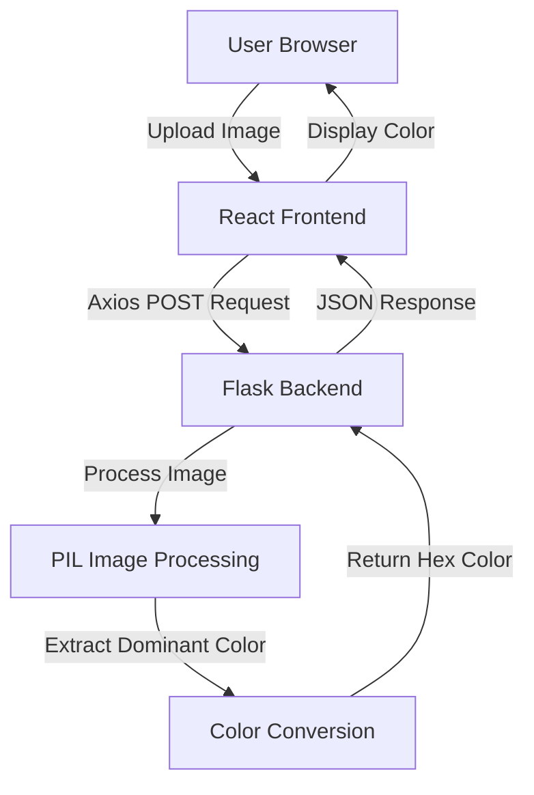
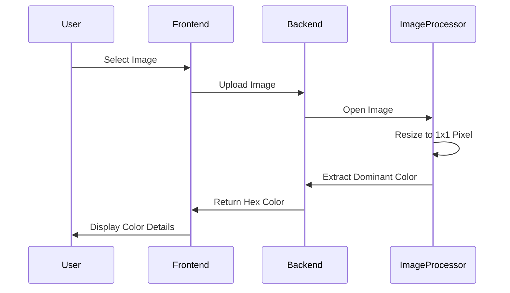

# 🐉 Dominant Color Detector


[](https://badge.fury.io/js/color-detector)
[](https://github.com/bniladridas/color-detector/graphs/commit-activity)
[](https://color-detector.vercel.app)

## Project Overview

A web application that allows users to upload an image and instantly detect its dominant color using React frontend and Flask backend.

## 🚀 Features

- Image upload functionality
- Dominant color extraction
- Color representation in multiple formats:
  - Hex
  - RGB
  - HSL
- Responsive and dragon-themed design
- Error handling for image uploads

## 🛠 Tech Stack

### Frontend
- React
- Axios
- Modern CSS with dragon-inspired theme

### Backend
- Python Flask
- PIL (Python Imaging Library)
- CORS support

## 🏗 System Architecture



## 🔄 Workflow Diagram



## 📦 Prerequisites

- Node.js (v14+)
- Python (v3.8+)
- npm or yarn
- Flask
- Pillow library

## 🔧 Installation

### Frontend Setup
```bash
# Clone the repository
git clone https://github.com/bniladridas/color-detector.git
cd color-detector

# Install dependencies
npm install

# Set environment variables
REACT_APP_API_URL=http://localhost:5000/upload

# Start development server
npm start
```

### Backend Setup
```bash
# Create virtual environment
python -m venv venv
source venv/bin/activate  # On Windows, use `venv\Scripts\activate`

# Install dependencies
pip install flask flask-cors pillow

# Run Flask server
python app.py
```

## 💡 How It Works

1. User selects an image via file input
2. Image is sent to Flask backend
3. Backend resizes image to 1x1 pixel
4. Dominant color is extracted
5. Color is converted to Hex/RGB/HSL
6. Results displayed in frontend

## 🔍 Color Extraction Algorithm

The application uses a simple yet effective method:
- Resize image to 1x1 pixel
- Extract the color of that single pixel
- Represents the image's dominant color

## 🛡 Error Handling

- Validates file type (images only)
- Handles upload and processing errors
- Provides user-friendly error messages

## 🌈 Color Representations

- **Hex**: Standard web color format
- **RGB**: Red, Green, Blue values
- **HSL**: Hue, Saturation, Lightness

## 🚧 Future Improvements

- Support for multiple color extraction methods
- Advanced color analysis
- More detailed color information
- Saving/sharing color palettes

## 🤝 Contributing

1. Fork the repository
2. Create your feature branch
3. Commit your changes
4. Push to the branch
5. Create a Pull Request

## 📄 License

MIT License

## 👥 Authors

- Niladri Das
- Dragon AI Team

## 🐉 Powered By Dragon AI
