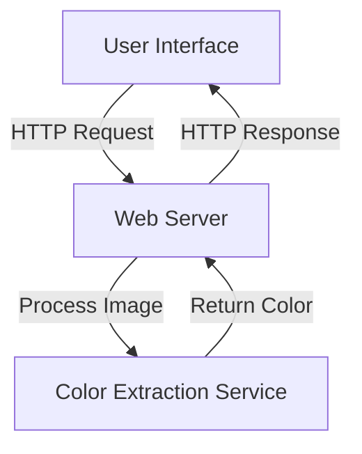

# 🐉 Dominant Color Detector - System Design Document

## 1. Overview

### 1.1 Purpose
A web application designed to extract and analyze the dominant color of an uploaded image using a lightweight, scalable architecture.

### 1.2 Key Objectives
- Provide fast, reliable image color extraction
- Ensure cross-platform compatibility
- Maintain a simple, intuitive user experience
- Implement robust error handling

## 2. System Architecture

### 2.1 High-Level Architecture


### 2.2 Component Breakdown
1. **Frontend (React)**
   - User interface
   - Image upload handling
   - State management
   - Result display

2. **Backend (Flask)**
   - Image processing
   - Color extraction logic
   - API endpoint management

3. **Image Processing (PIL)**
   - Image resizing
   - Color pixel extraction

## 3. Detailed Design

### 3.1 Frontend Component
- **Technology**: React
- **Key Features**:
  - File input validation
  - Axios for API communication
  - State management with React Hooks
  - Error handling
  - Responsive design

### 3.2 Backend Component
- **Technology**: Python Flask
- **Key Responsibilities**:
  - Image upload endpoint
  - CORS configuration
  - Image processing
  - Error handling

### 3.3 Color Extraction Algorithm
```python
def extract_dominant_color(image):
    # Resize image to 1x1 pixel
    small_image = image.resize((1, 1))
    
    # Extract color from single pixel
    dominant_color = small_image.getpixel((0, 0))
    
    # Convert to hex
    hex_color = "#{:02x}{:02x}{:02x}".format(*dominant_color)
    
    return hex_color
```

## 4. Performance Considerations

### 4.1 Performance Metrics
- **Image Processing Time**: < 100ms
- **Maximum Image Size**: 5MB
- **Supported Formats**: JPEG, PNG, WebP

### 4.2 Scalability Strategies
- Lightweight processing
- Stateless backend design
- Minimal resource consumption

## 5. Error Handling

### 5.1 Error Types
- Invalid file type
- Image processing errors
- Network communication errors
- Size limitations

### 5.2 Error Response Structure
```json
{
    "status": "error",
    "message": "Detailed error description",
    "code": 400
}
```

## 6. Security Considerations

### 6.1 Input Validation
- File type checking
- File size limitation
- Sanitize file names
- Prevent unauthorized access

### 6.2 CORS Configuration
- Limited to specific origins
- Prevent cross-site scripting

## 7. Deployment Architecture

### 7.1 Recommended Setup
- Frontend: Vercel/Netlify
- Backend: Heroku/AWS Lambda
- Static Assets: CDN

### 7.2 Environment Configuration
- Development
- Staging
- Production

## 8. Monitoring & Logging

### 8.1 Logging Components
- Request logs
- Error tracking
- Performance metrics

### 8.2 Recommended Tools
- Sentry for error tracking
- CloudWatch for monitoring
- Custom logging mechanisms

## 9. Future Enhancements

### 9.1 Potential Features
- Multiple color extraction
- Advanced color analysis
- Color palette generation
- Machine learning color prediction

### 9.2 Technical Improvements
- Caching mechanisms
- More sophisticated color algorithms
- Support for video frame color extraction

## 10. Conclusion

A lightweight, efficient system designed for rapid color extraction with potential for significant future expansion.

### System Design Principles Applied
- Separation of concerns
- Scalability
- Performance optimization
- Error resilience

**Version**: 1.0.0
**Last Updated**: 02/12/2024